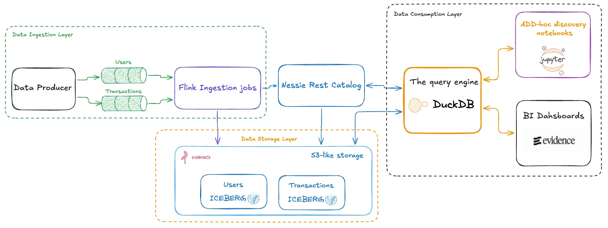

# Kafka → Iceberg via Flink 

A self-contained demo that streams synthetic JSON events from Kafka into Apache
Iceberg tables using Apache Flink, with a live BI dashboard powered by Evidence.

## Architecture




## Services

| Service             | Image / Build                              | Exposed port       |
|---------------------|--------------------------------------------|--------------------|
| kafka               | apache/kafka:4.0.2 (KRaft, no ZooKeeper)   | 9092               |
| minio               | minio/minio                                | 9000, 9001 (UI)    |
| minio-init          | minio/mc (creates bucket on first boot)    | —                  |
| nessie              | ghcr.io/projectnessie/nessie:0.107.5       | 19120              |
| flink-jobmanager    | custom (Flink + Iceberg + S3 JARs)         | 8081 (UI)          |
| flink-taskmanager   | custom                                     | —                  |
| flink-sql-job       | custom (submits SQL job then exits)        | —                  |
| jupyter             | custom (DuckDB + Iceberg + pyiceberg)      | 8888               |
| evidence            | custom (Node 20, Evidence 40.x)            | 3000               |
| kafka-producer      | custom (Python 3, kafka-python)            | —                  |

## Quick start

```bash
docker compose up --build
```

First boot takes a few minutes while Docker builds the images and the Flink SQL
job is submitted. Iceberg commits happen on Flink checkpoints (every 30 s), so
wait at least 30 seconds before expecting data in the dashboard.

## Kafka topics & event schemas

Two topics are produced by the Python producer:

**users**
```json
{ "user_id": "user-001", "name": "Alice Smith", "email": "alice.smith1@example.com",
  "country": "US", "created_at": "2024-04-22T10:00:00.000" }
```

**transactions**
```json
{ "transaction_id": "txn-000001", "user_id": "user-001", "amount": 149.99,
  "currency": "USD", "type": "PURCHASE", "status": "COMPLETED",
  "event_time": "2024-04-22T10:00:00.000" }
```

Users are seeded upfront so transactions always reference a valid `user_id`.
The producer then streams transactions continuously at a configurable rate
(default: 2 events/sec, set via `EVENTS_PER_SECOND`).

## Iceberg catalog (Nessie)

Flink, DuckDB (Jupyter + Evidence) all share the same catalog via Nessie's
Iceberg REST API at `http://nessie:19120/iceberg`. The two Iceberg tables are:

- `iceberg_catalog.demo.users`
- `iceberg_catalog.demo.transactions`

## Endpoints

| Service     | URL                                         | Credentials              |
|-------------|---------------------------------------------|--------------------------|
| Evidence BI | http://localhost:3000                       | —                        |
| Flink UI    | http://localhost:8081                       | —                        |
| JupyterLab  | http://localhost:8888                       | no password              |
| MinIO UI    | http://localhost:9001                       | minioadmin / minioadmin  |
| Nessie API  | http://localhost:19120/iceberg/v1/config    | —                        |

## Evidence dashboard

The Evidence dashboard at **http://localhost:3000** shows live metrics sourced
from the Iceberg tables. On startup it:

1. Runs `evidence sources` — connects DuckDB to Nessie via the Iceberg REST
   catalog, executes the SQL queries in `sources/demo_lh/`, and writes
   Parquet snapshots to `.evidence/template/static/data/`.
2. Starts the Vite dev server which serves the dashboard at port 3000.

The page (`pages/index.md`) uses inline SQL code blocks that query the
pre-built Parquet snapshots loaded into DuckDB-WASM in the browser:

```sql
select * from demo_lh.kpis
```

To refresh data without rebuilding the container:

```bash
docker exec evidence node_modules/.bin/evidence sources
```

## JupyterLab exploration

Open **http://localhost:8888** and run `query_iceberg.ipynb`. It attaches
DuckDB directly to the Nessie REST catalog and queries both tables.

## Query from Flink SQL client

```bash
docker exec -it flink-jobmanager /opt/flink/bin/sql-client.sh
```

```sql
USE CATALOG iceberg_catalog;
USE demo;

SELECT status, COUNT(*) AS cnt FROM transactions GROUP BY status;
```

## Tear down

```bash
docker compose down -v
```